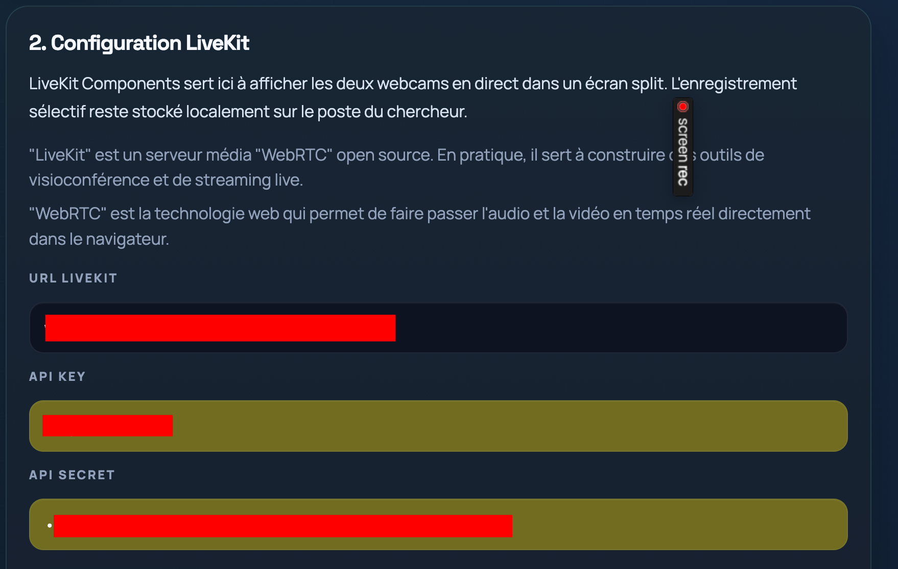
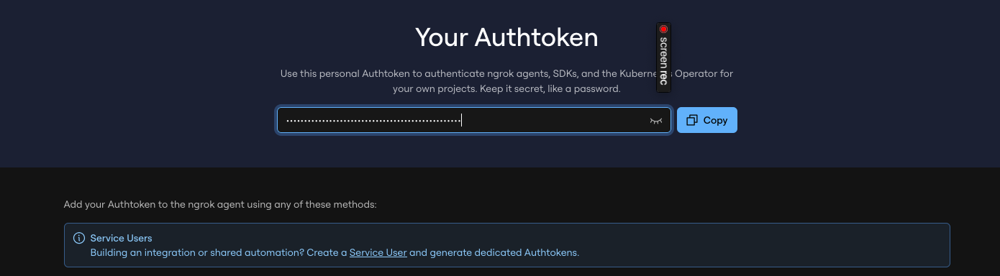
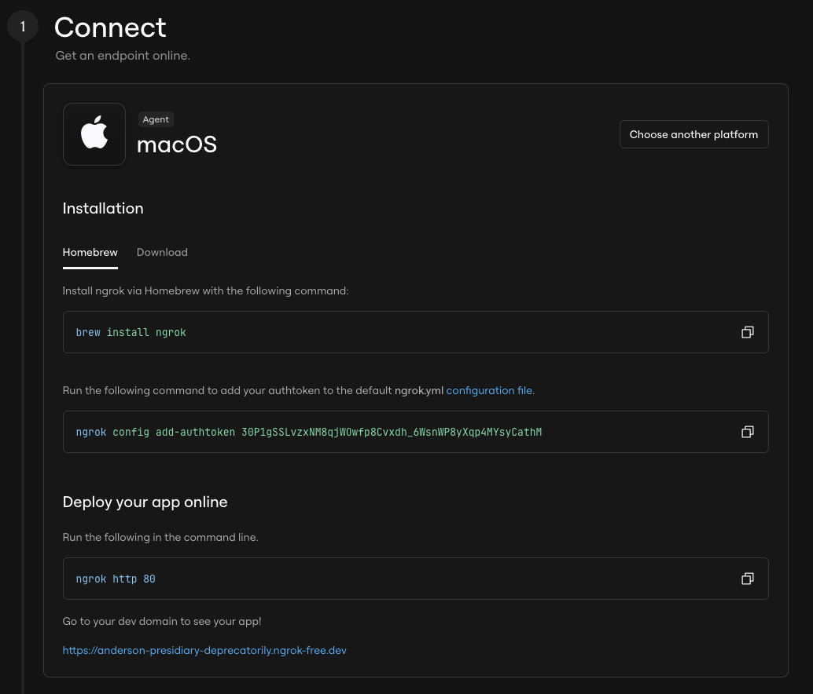
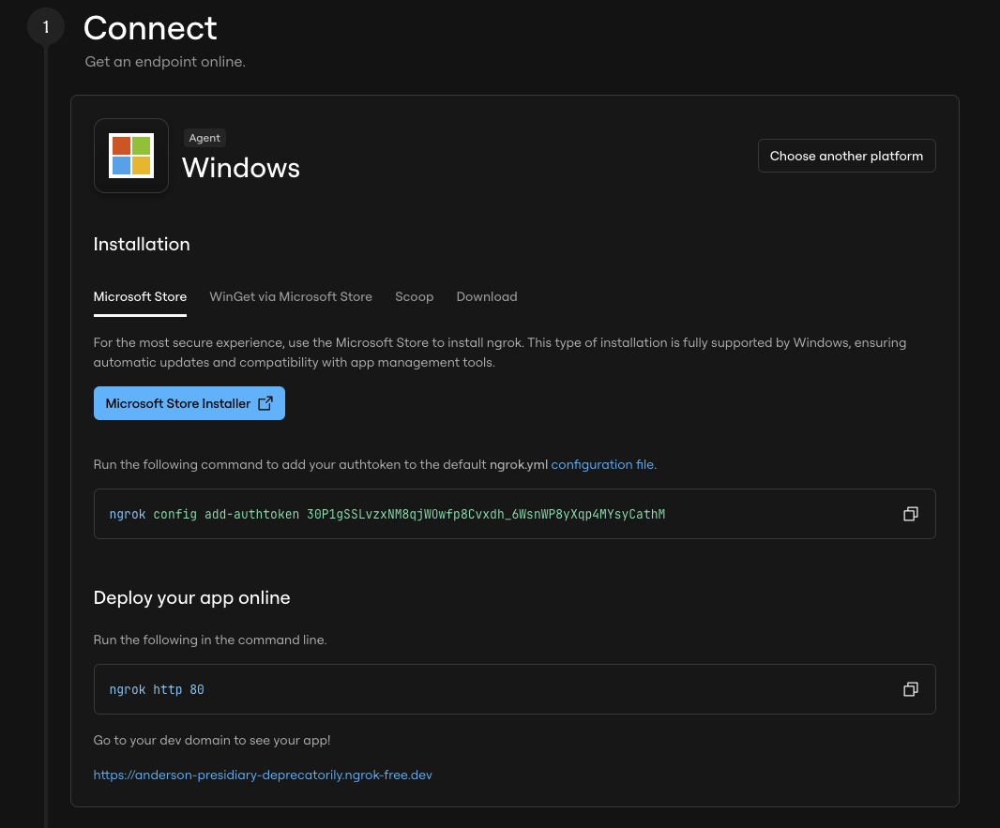
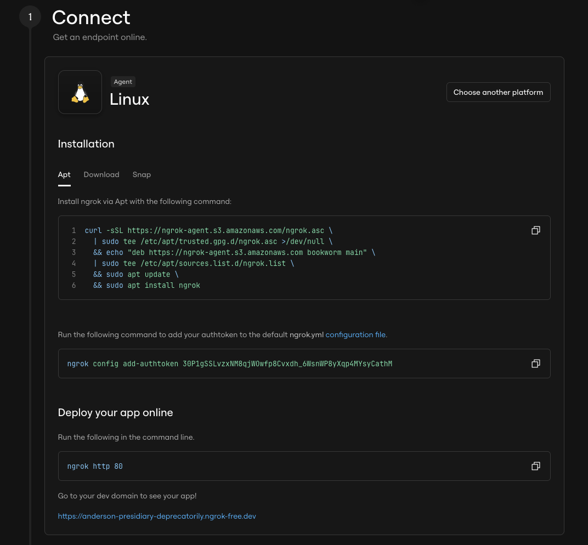

# Aide - Outil local de collecte d'entretiens

## 1. Objectif

Cet outil permet à un enquêteur de :

- lancer une petite application web sur son propre ordinateur
- ouvrir un tableau de bord enquêteur avec des boutons
- envoyer un lien temporaire à un enquêté
- recevoir directement en local la vidéo de l'entretien
- conserver chaque entretien dans un dossier séparé
- extraire automatiquement l'audio
- produire une transcription avec `faster-whisper`

Le point important est le suivant :

- le navigateur de l'enquêté enregistre l'entretien
- la vidéo est envoyée vers le serveur local de l'enquêteur
- les fichiers sont stockés sur la machine locale de l'enquêteur, pas sur un cloud tiers

## 2. Ce que fait exactement l'application

### Côté enquêté

L'enquêté :

1. ouvre le lien LiveKit transmis par l'enquêteur
2. lit les informations de base
3. coche les cases de consentement
4. autorise temporairement caméra et micro
5. rejoint la salle d'entretien
6. attend que l'enquêteur pilote l'enregistrement
7. attend la confirmation d'envoi

### Côté enquêteur

L'enquêteur :

1. lance l'application en double-cliquant le lanceur
2. ouvre automatiquement le tableau de bord enquêteur
3. crée une session LiveKit avec un bouton
4. transmet le lien enquêté
5. récupère automatiquement la vidéo dans le dossier local
6. retrouve ensuite l'audio, les métadonnées et la transcription dans le même dossier de session

## 3. Structure des fichiers

Le projet utilise cette structure :

```text
visio_multimodale/
  app/
    server.py
    static/
      style.css
  data/
    sessions/
      session_.../
        consent.json
        metadata.json
        processing.json
        raw_video.webm
        video.mp4
        audio.wav
        audio.mp3
        transcript.txt
        transcript.json
        logs.txt
  tmp/
  config.example.json
  requirements.txt
  Lancer.command
  Arreter.command
  start_mac.sh
  stop_mac.sh
  start_windows.bat
  stop_windows.bat
```

## 4. Fonctionnement général

L'application est maintenant centrée sur `LiveKit Components` :

- l'enquêteur crée une session
- il ouvre sa salle de pilotage
- il transmet le lien participant
- l'enquêté rejoint la salle à distance
- l'enquêteur déclenche l'enregistrement depuis sa propre page

## 5. Lancer l'outil

### Mac

Double-clique :

- `Lancer.command`

ou lance :

```bash
chmod +x start_mac.sh
./start_mac.sh
```

### Windows

```bat
start_windows.bat
```

Le serveur démarre sur :

`http://127.0.0.1:8000`

Le tableau de bord enquêteur est :

`http://127.0.0.1:8000/admin.html`

La page dédiée aux corpus est :

`http://127.0.0.1:8000/corpus.html`

### Arrêter l'application sur Mac

Double-clique :

- `Arreter.command`

## 6. Créer une session LiveKit

Depuis le tableau de bord enquêteur :

1. ouvrir `http://127.0.0.1:8000/admin.html`
2. renseigner `LiveKit URL`, `API Key` et `API Secret`
3. démarrer l'accès distant
4. saisir le nom de l'entretien
5. définir les deux rôles dans les champs distincts :
   `Rôle participant` et `Rôle enquêteur`
6. cliquer sur `Créer la session LiveKit`
7. copier le lien participant généré par l'application
8. ouvrir ensuite la salle enquêteur

### Où récupérer les informations LiveKit ?

La capture ci-dessous montre les informations LiveKit à récupérer :

Dans cette application, vous devez ensuite les saisir dans
"2. Configuration LiveKit" : "URL LiveKit", "API Key" et "API Secret".



Une fois enregistrées, ces informations sont stockées localement dans `config.json`.

## 7. Accès distant avec ngrok

### Prérequis enquêteur

Avant de lancer un entretien, l'enquêteur doit disposer :

- d'un compte `ngrok` vérifié
- d'une `LiveKit URL`
- d'une `API Key` LiveKit
- d'une `API Secret` LiveKit
- de `FFmpeg` installé sur le poste
- de `faster-whisper` si la transcription automatique est souhaitée

Dans l'application, la taille du modèle Whisper peut ensuite être choisie entre :

- `small`
- `medium`

Le serveur tourne localement sur l'ordinateur de l'enquêteur.
Dans cette application, `ngrok` est la solution utilisée pour donner accès à l'enquêté à distance.

### À quoi sert ngrok ?

[`ngrok`](https://ngrok.com/) crée une URL publique en "https" vers l'application qui tourne sur l'ordinateur de l'enquêteur (votre ordinateur).
Dans cette application, c'est la solution utilisée pour donner accès au participant.
Le participant n'installe rien : il ouvre simplement le lien que vous allez lui envoyer.

### Procédure ngrok

Liens officiels utiles :

- `https://ngrok.com/downloads`
- `https://dashboard.ngrok.com/get-started/your-authtoken`
- `https://ngrok.com/docs/guides/share-localhost/`

Capture d'écran utile pour repérer l'authtoken :



Captures de connexion ngrok par système :







#### Procédure ngrok sur Mac

1. créer un compte `ngrok`
2. récupérer l'`authtoken` dans le tableau de bord :

- `https://dashboard.ngrok.com/get-started/your-authtoken`

Le compte `ngrok` doit être vérifié une fois avant le premier tunnel.

3. installer `ngrok` sur le Mac :

```bash
brew install ngrok
```

4. coller l'authtoken dans l'application puis cliquer sur "Enregistrer l'authtoke"
5. cliquer sur "Démarrer l'accès distant"
6. créer la session LiveKit
7. copier ensuite le lien participant généré par l'application

Si tu ne veux pas utiliser `Homebrew`, tu peux aussi télécharger l'archive macOS depuis :

- `https://ngrok.com/downloads/mac-os`

#### Procédure ngrok sur Windows

1. créer un compte `ngrok`
2. récupérer l'`authtoken` dans le tableau de bord :

- `https://dashboard.ngrok.com/get-started/your-authtoken`

Le compte `ngrok` doit être vérifié une fois avant le premier tunnel.

3. télécharger `ngrok` depuis :
   `https://ngrok.com/downloads/windows`
4. ajouter `ngrok.exe` au `PATH` Windows
5. coller l'authtoken dans l'application puis cliquer sur "Enregistrer l'authtoke"
6. cliquer sur "Démarrer l'accès distant"
7. créer la session LiveKit
8. copier ensuite le lien participant généré par l'application

#### Quel lien envoyer à l'enquêté ?

N'envoyez pas l'URL brute de `ngrok`.

Le seul bon lien à envoyer est le lien participant généré par l'application après la création de session.

#### Démarche côté enquêté

L'enquêté doit simplement :

1. ouvrir le lien envoyé
2. lire les informations et cocher les cases de consentement
3. autoriser la caméra et le micro dans le navigateur
4. rejoindre la salle d'entretien
5. attendre que l'enquêteur pilote l'enregistrement
6. attendre le message indiquant que l'entretien a bien été enregistré

#### De quoi l'enquêté a besoin

L'enquêté n'a aucune librairie à installer.

Il lui faut simplement :

- un navigateur récent (`Chrome`, `Edge`, `Firefox` ou `Safari`)
- une webcam et un micro qui fonctionnent
- une connexion internet stable
- le lien envoyé par l'enquêteur

Il n'a pas besoin d'installer `Python`, `LiveKit`, `ngrok` ou un autre logiciel.

#### Qualité de la piste enquêteur

Pour éviter que la voix du participant revienne dans la piste audio enquêteur, il est préférable que l'enquêteur utilise un casque ou des écouteurs.

Sans casque, le micro de l'enquêteur peut reprendre le son des haut-parleurs et créer une fausse parole côté enquêteur dans la transcription.

#### Test de l'interface : si vous êtes seul

Dans l'état actuel, un test complet demande deux appareils distincts.

Seul, vous pouvez :

- lancer l'application
- ouvrir `http://127.0.0.1:8000/admin.html`
- créer une session LiveKit
- ouvrir la salle enquêteur
- vérifier les écrans et l'interface

Mais pour valider le scénario complet avec les deux flux audio/vidéo et la transcription des deux rôles, il faut un deuxième appareil.

La recommandation actuelle est donc :

- enquêteur sur l'ordinateur principal
- participant sur un autre ordinateur ou un autre appareil réellement utilisable

## 8. Récupération locale des fichiers

Quand l'enquêté termine l'entretien, l'application :

1. sauvegarde la vidéo brute dans le dossier de session
2. crée une version standardisée `video.mp4`
3. crée `metadata.json`
4. crée `consent.json`
5. lance un traitement de fond

Le traitement de fond essaye ensuite de :

1. produire `video.mp4` avec `ffmpeg`
2. extraire `audio.wav` avec `ffmpeg`
3. produire `audio.mp3` avec `ffmpeg`
4. produire une transcription séparée par piste avec `faster-whisper`

Le statut du traitement est visible dans :

`processing.json`

## 9. Librairies à installer sur Mac

### Fichier de transcription

Le fichier "requirements.txt" regroupe les dépendances Python nécessaires à la transcription.

Il installe surtout :

- "faster-whisper"
- "numpy<2"

### Installer les librairies Python de transcription

Crée de préférence un environnement virtuel puis installe :

```bash
python3 -m venv .venv
source .venv/bin/activate
pip install -r requirements.txt
```

### Installer `ffmpeg`

`ffmpeg` est nécessaire pour :

- produire `video.mp4`
- produire `audio.wav`
- produire `audio.mp3`

Sur Mac :

```bash
brew install ffmpeg
```

### Installer `ngrok`

`ngrok` est nécessaire pour créer le lien distant du participant.

Sur Mac :

```bash
brew install ngrok
```

### Sur Windows

```bat
python -m venv .venv
.venv\Scripts\activate
pip install -r requirements.txt
```

## 10. Configuration

Tu peux créer un fichier `config.json` à la racine du projet à partir de `config.example.json`.

Exemple :

```json
{
  "title": "Collecte d'entretien clinique",
  "max_upload_size_mb": 1024,
  "ffmpeg_binary": "ffmpeg",
  "enable_mp4_export": true,
  "enable_mp3_export": true,
  "enable_audio_extraction": true,
  "enable_transcription": true,
  "whisper_model_size": "small",
  "whisper_language": "fr",
  "whisper_device": "cpu",
  "whisper_compute_type": "int8",
  "session_prefix": "entretien"
}
```

### Paramètres utiles

- `max_upload_size_mb` : taille maximale autorisée pour l'envoi
- `enable_mp4_export` : produit automatiquement une copie standardisée `video.mp4`
- `enable_mp3_export` : produit automatiquement une copie standardisée `audio.mp3`
- `enable_audio_extraction` : active ou non `ffmpeg`
- `enable_transcription` : active ou non Whisper
- `whisper_model_size` : `small` ou `medium`
- `whisper_language` : langue forcée pour Whisper, ici `fr`

## 10 bis. Installer FFmpeg

`FFmpeg` est nécessaire pour :

- créer `video.mp4`
- créer `audio.wav`
- créer `audio.mp3`

### Installer FFmpeg sur Mac

Si `Homebrew` est déjà installé :

```bash
brew install ffmpeg
```

Vérifier ensuite :

```bash
ffmpeg -version
```

Référence officielle :

- `https://ffmpeg.org/download.html#build-macos`

### Installer FFmpeg sur Windows

1. ouvrir la page officielle :
   `https://ffmpeg.org/download.html#build-windows`
2. télécharger un build Windows recommandé par la page officielle
3. décompresser l'archive
4. repérer le dossier `bin` contenant `ffmpeg.exe`
5. ajouter ce dossier `bin` au `PATH` Windows

Puis vérifier dans `PowerShell` :

```powershell
ffmpeg -version
```

## 10 ter. Mode LiveKit Components

Le mode `LiveKit Components` permet :

- d'afficher les deux webcams en direct dans un écran split
- d'enregistrer uniquement la vidéo de l'enquêté
- d'enregistrer séparément l'audio de l'enquêteur

### LiveKit et WebRTC

`LiveKit` est un serveur média `WebRTC` open source.
En pratique, il sert à construire des outils de visioconférence et de streaming live.
`WebRTC` est la technologie web qui permet de faire passer l'audio et la vidéo en temps réel directement dans le navigateur.

### Ce que fait LiveKit Components ici

Dans ce projet :

- `LiveKit Components` sert à la visioconférence temps réel
- le stockage des fichiers reste local sur l'ordinateur du chercheur
- la vidéo enregistrée reste celle de l'enquêté
- l'audio de l'enquêteur peut être conservé dans un dossier séparé

### Préparer LiveKit

Il faut disposer :

- d'une `LiveKit URL`
- d'une `API Key`
- d'une `API Secret`

Ces valeurs sont à renseigner dans le tableau de bord enquêteur.

### Démarche LiveKit

1. ouvrir le tableau de bord enquêteur
2. renseigner `LiveKit URL`, `API Key`, `API Secret`
3. enregistrer la configuration
4. créer une session LiveKit
5. l'enquêteur ouvre sa salle de pilotage
6. l'enquêteur copie le lien unique à transmettre à l'enquêté
7. l'enquêté ouvre ce lien et rejoint la salle
8. chacun rejoint la session avec caméra et micro
9. l'enquêté valide le consentement
10. l'enquêteur déclenche l'enregistrement depuis sa propre page

### Fichiers attendus en mode LiveKit

Dans un dossier de session LiveKit, on trouvera généralement :

```text
entretien_.../
  metadata.json
  livekit_session.json
  transcript_participant.json
  transcript_participant.txt
  transcript_enqueteur.json
  transcript_enqueteur.txt
  transcript_dialogue.json
  transcript_dialogue.txt
  segments_diarises.json
  segments_diarises.txt
  participant/
    raw_video.webm
    video.mp4
    audio.wav
    audio.mp3
    transcript.json
    transcript.txt
  investigator/
    raw_audio.webm
    audio.wav
    audio.mp3
    transcript.json
    transcript.txt
```

La sortie attendue est donc :

- vidéo enquêté en `mp4`
- audio enquêté en `wav`
- audio enquêté en `mp3`
- segments de texte diarises
- audio enquêteur en `wav`
- audio enquêteur en `mp3`
- `transcript_participant`
- `transcript_enqueteur`
- `transcript_dialogue`

Le pipeline retenu est le suivant :

- la piste `participant` reçoit le nom saisi dans `Rôle participant`
- la piste `investigator` reçoit le nom saisi dans `Rôle enquêteur`
- on transcrit séparément chaque piste
- les deux transcriptions sont ensuite fusionnées par ordre temporel dans `transcript_dialogue`

## 11. Commandes utiles

### Lancer le serveur

```bash
python3 app/server.py serve --host 127.0.0.1 --port 8000
```

## 12. Tableau de bord enquêteur

L'interface enquêteur est disponible dans :

`/admin.html`

Elle permet de :

- détecter si le poste est un `Mac` ou un `PC Windows`
- basculer manuellement entre `Mac` et `PC Windows`
- afficher les bonnes commandes selon le système
- afficher un onglet `Aide` avec la procédure `ngrok` et la démarche côté enquêté
- voir si le serveur fonctionne
- vérifier si `ffmpeg` et `ngrok` sont installés
- configurer `LiveKit`
- créer une session `LiveKit`
- choisir la taille du modèle Whisper entre `small` et `medium`
- voir les sessions reçues
- ouvrir un onglet `Ouvrir un corpus`
- importer une piste audio avec une transcription existante
- écouter la piste audio et modifier le texte dans l'interface
- ouvrir le dossier du projet
- ouvrir le dossier global des sessions
- ouvrir le dossier d'une session précise

## 12 bis. Ouvrir un corpus

Dans l'onglet `Ouvrir un corpus`, tu peux :

1. saisir un nom de corpus
2. importer une piste audio
3. importer en option une transcription `.txt` ou `.json`
4. ouvrir le corpus dans l'éditeur
5. écouter l'audio et modifier le texte
6. enregistrer la version corrigée

Le corpus est stocké dans :

`data/corpora/`

## 13. Sécurité minimale recommandée

Pour un usage de recherche, je recommande au minimum :

- utiliser des codes participant pseudonymisés, jamais des noms réels
- ne pas laisser le tunnel public ouvert en dehors des entretiens
- stocker le dossier du projet sur un disque protégé
- éviter les sauvegardes cloud automatiques non maîtrisées

## 14. Limites actuelles du MVP

Ce MVP est volontairement simple :

- il n'y a pas encore de reprise d'upload interrompu
- l'envoi se fait à la fin de l'entretien, pas en streaming continu
- il n'y a pas encore de chiffrement applicatif des fichiers au repos
- la transcription dépend de `faster-whisper` et peut nécessiter un téléchargement de modèle

## 15. Vérifier que tout fonctionne

### Santé du serveur

Quand le serveur tourne, tu peux vérifier :

```bash
curl http://127.0.0.1:8000/api/health
```

### Vérifier les fichiers

Après un entretien, vérifie la présence d'un dossier dans :

`data/sessions/`

avec au minimum :

- `raw_video.webm` ou `raw_video.mp4`
- `video.mp4`
- `metadata.json`
- `consent.json`
- `processing.json`
- `segments_diarises.json`
- `segments_diarises.txt`
- `transcript_participant.json`
- `transcript_participant.txt`
- `transcript_enqueteur.json`
- `transcript_enqueteur.txt`
- `transcript_dialogue.json`
- `transcript_dialogue.txt`

et le plus souvent aussi :

- `audio.wav`
- `audio.mp3`
- `transcript.txt`
- `transcript.json`

## 16. Conseils d'usage

- fais toujours un entretien test avant un vrai recueil
- vérifie la qualité micro du navigateur de l'enquêté
- ferme les autres applications lourdes sur la machine enquêteur
- garde `ffmpeg` installé si tu veux récupérer l'audio facilement
- commence avec `whisper_model_size = "small"` pour les premiers essais
